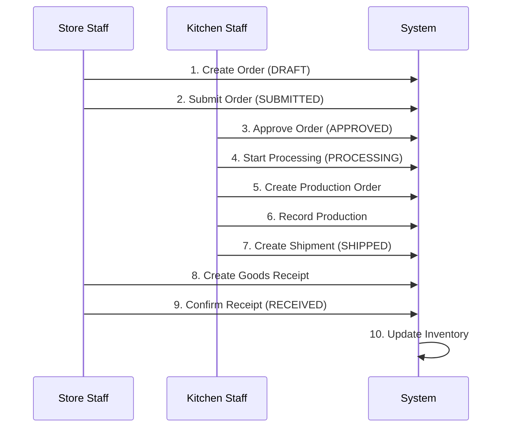

# 🎨 FRONTEND API GUIDE - Central Kitchen Management System

> Hướng dẫn đầy đủ cho Frontend Developer: Roles, Permissions, Workflows & API Endpoints

**Base URL:** `http://localhost:5001/api`

**Last Updated:** January 2024

---

## 📋 MỤC LỤC

1. [Roles & Permissions](#roles--permissions)
2. [Authentication Flow](#authentication-flow)
3. [Franchise Store Staff Features](#franchise-store-staff-features)
4. [Central Kitchen Staff Features](#central-kitchen-staff-features)
5. [Supply Coordinator Features](#supply-coordinator-features)
6. [Manager Features](#manager-features)
7. [Admin Features](#admin-features)
8. [Common Workflows](#common-workflows)
9. [Data Models](#data-models)
10. [Error Handling](#error-handling)

---

## 🔐 ROLES & PERMISSIONS

### Role Hierarchy

```
ADMIN (Quản trị viên)
  └─ Full access to all features
  
MANAGER (Quản lý vận hành)
  └─ Access to operations, reports, master data
  
CHEF (Bếp trưởng - Central Kitchen Staff)
  └─ Production, shipments, inventory management
  
STORE_STAFF (Nhân viên cửa hàng - Franchise Store Staff)
  └─ Orders, receipts, store inventory
```

### Permission Matrix

| Feature | ADMIN | MANAGER | CHEF | STORE_STAFF |
|---------|-------|---------|------|-------------|
| **Users Management** | ✅ | ❌ | ❌ | ❌ |
| **Master Data** | ✅ | ✅ | ❌ | ❌ |
| **Create Orders** | ✅ | ✅ | ❌ | ✅ |
| **Approve Orders** | ✅ | ✅ | ✅ | ❌ |
| **Production Orders** | ✅ | ✅ | ✅ | ❌ |
| **Shipments** | ✅ | ✅ | ✅ | ❌ |
| **Goods Receipts** | ✅ | ✅ | ❌ | ✅ |
| **Inventory Adjust** | ✅ | ✅ | ❌ | ❌ |
| **Return Requests** | ✅ | ✅ | ✅ | ✅ |
| **Dashboard** | ✅ | ✅ | ✅ | ✅ |
| **Alerts** | ✅ | ✅ | ✅ | ✅ |

---

## 🔑 AUTHENTICATION FLOW

### 1. Login

**Endpoint:** `POST /api/auth/login`

**Request:**
```json
{
  "username": "admin",
  "password": "admin123"
}
```

**Response:**
```json
{
  "success": true,
  "message": "Login successful",
  "data": {
    "token": "eyJhbGciOiJIUzI1NiIsInR5cCI6IkpXVCJ9...",
    "user": {
      "id": "user_admin",
      "username": "admin",
      "full_name": "System Admin",
      "org_unit_id": "org_kitchen_hcm",
      "roles": [
        {
          "id": "role_admin",
          "code": "ADMIN",
          "name": "Administrator"
        }
      ]
    }
  }
}
```

**Frontend Actions:**
1. Store `token` in localStorage/sessionStorage
2. Store `user` info in state management (Redux/Zustand)
3. Set Authorization header for all subsequent requests
4. Redirect based on role:
   - ADMIN → Admin Dashboard
   - MANAGER → Manager Dashboard
   - CHEF → Kitchen Dashboard
   - STORE_STAFF → Store Dashboard

### 2. Get Current User

**Endpoint:** `GET /api/auth/me`

**Headers:**
```
Authorization: Bearer {token}
```

**Use Case:** Verify token on app load, refresh user data

### 3. Logout

**Endpoint:** `POST /api/auth/logout`

**Headers:**
```
Authorization: Bearer {token}
```

**Response:**
```json
{
  "success": true,
  "message": "Logout successful",
  "data": null
}
```

**Frontend Actions:**
1. Call logout endpoint (optional - for logging purposes)
2. Remove token from localStorage/sessionStorage
3. Clear user data from state management
4. Redirect to login page

**Implementation Example:**
```javascript
const logout = async () => {
  try {
    // Optional: Call backend for logging
    await axios.post('/api/auth/logout');
  } catch (error) {
    console.error('Logout error:', error);
  } finally {
    // Always clear local data
    localStorage.removeItem('token');
    localStorage.removeItem('user');
    // Clear Redux/Zustand state
    dispatch(clearAuth());
    // Redirect
    navigate('/login');
  }
};
```

### 4. Change Password

**Endpoint:** `PUT /api/auth/change-password`

**Headers:**
```
Authorization: Bearer {token}
```

**Request:**
```json
{
  "current_password": "oldpassword123",
  "new_password": "newpassword456"
}
```

**Response Success:**
```json
{
  "success": true,
  "message": "Password changed successfully",
  "data": null
}
```

**Response Error (Wrong Current Password):**
```json
{
  "success": false,
  "message": "Current password is incorrect",
  "statusCode": 401
}
```

**Validation Rules:**
- Current password is required
- New password is required
- New password must be at least 6 characters

**Frontend Implementation:**
```javascript
const changePassword = async (currentPassword, newPassword) => {
  try {
    const response = await axios.put('/api/auth/change-password', {
      current_password: currentPassword,
      new_password: newPassword
    });
    
    toast.success('Password changed successfully');
    // Optional: Force re-login
    // logout();
  } catch (error) {
    if (error.response?.status === 401) {
      toast.error('Current password is incorrect');
    } else {
      toast.error('Failed to change password');
    }
  }
};
```

### 5. Reset Password (Admin Only)

**Endpoint:** `PUT /api/auth/reset-password/:userId`

**Headers:**
```
Authorization: Bearer {token}
```

**Request:**
```json
{
  "new_password": "resetpassword123"
}
```

**Response:**
```json
{
  "success": true,
  "message": "Password reset successfully",
  "data": null
}
```

**Use Case:** Admin can reset password for any user without knowing current password

**Frontend Implementation:**
```javascript
const resetUserPassword = async (userId, newPassword) => {
  try {
    await axios.put(`/api/auth/reset-password/${userId}`, {
      new_password: newPassword
    });
    
    toast.success('Password reset successfully');
  } catch (error) {
    toast.error('Failed to reset password');
  }
};
```


---

## 🏪 FRANCHISE STORE STAFF FEATURES

### Role: `STORE_STAFF`
### Org Unit Type: `STORE`

### Feature 1: Tạo Đơn Đặt Hàng (Create Internal Order)

**User Story:** Nhân viên cửa hàng cần đặt hàng nguyên liệu/thành phẩm từ bếp trung tâm

**API Endpoint:** `POST /api/internal-orders`

**Request Body:**
```json
{
  "store_org_unit_id": "org_store_q1",
  "order_date": "2024-01-15",
  "lines": [
    {
      "item_id": "item_sauce_bol",
      "qty_ordered": 20,
      "uom_id": "uom_pack",
      "unit_price": 250000
    },
    {
      "item_id": "item_beef",
      "qty_ordered": 50,
      "uom_id": "uom_kg",
      "unit_price": 150000
    }
  ]
}
```

**Response:**
```json
{
  "success": true,
  "message": "Order created successfully",
  "data": {
    "_id": "ord_1705305600000",
    "order_no": "SO-1002",
    "status": "DRAFT",
    "total_amount": 12500000,
    "lines": [...]
  }
}
```

**Frontend Implementation:**
```javascript
// 1. Form để chọn items
// 2. Tính toán line_total = qty_ordered * unit_price
// 3. Tính total_amount = sum(line_total)
// 4. Submit order với status = DRAFT
// 5. Có thể edit order khi status = DRAFT
// 6. Submit order để chuyển status sang SUBMITTED
```

**Status Flow:**
```
DRAFT (Nháp) 
  → SUBMITTED (Đã gửi) 
  → APPROVED (Đã duyệt - bởi Kitchen/Manager)
  → PROCESSING (Đang xử lý)
  → SHIPPED (Đã giao)
  → RECEIVED (Đã nhận - bởi Store)
```


### Feature 2: Theo Dõi Đơn Hàng (Track Orders)

**API Endpoints:**

1. **Get All Orders (List View)**
   ```
   GET /api/internal-orders?page=1&limit=10&status=SUBMITTED
   ```

2. **Get Order Detail**
   ```
   GET /api/internal-orders/:id
   ```

**Response (Detail):**
```json
{
  "success": true,
  "data": {
    "_id": "ord_001",
    "order_no": "SO-1001",
    "status": "SHIPPED",
    "total_amount": 2500000,
    "lines": [
      {
        "_id": "ord_line_01",
        "item_id": {
          "sku": "FP001",
          "name": "Sốt Bolognese (Túi 1kg)"
        },
        "qty_ordered": 10,
        "fulfillment": {
          "qty_shipped_total": 10,
          "qty_received_total": 0
        }
      }
    ]
  }
}
```

**Frontend UI Components:**
- Order List Table (with filters: status, date range)
- Order Detail Page
- Status Badge (color-coded)
- Progress Tracker (visual timeline)

### Feature 3: Cập Nhật Trạng Thái Đơn (Update Order Status)

**API Endpoint:** `PUT /api/internal-orders/:id/status`

**Request:**
```json
{
  "status": "SUBMITTED"
}
```

**Valid Transitions for Store Staff:**
- DRAFT → SUBMITTED (Submit order)
- SHIPPED → RECEIVED (Confirm received - but use Goods Receipt instead)

### Feature 4: Nhận Hàng (Goods Receipt)

**User Story:** Xác nhận đã nhận hàng từ shipment

**Step 1: Create Goods Receipt**
```
POST /api/goods-receipts
```

**Request:**
```json
{
  "shipment_id": "ship_001",
  "received_date": "2024-01-16",
  "lines": [
    {
      "shipment_line_id": "ship_line_01",
      "item_id": "item_sauce_bol",
      "qty_received": 10,
      "qty_rejected": 0
    }
  ]
}
```

**Step 2: Confirm Receipt (Update Inventory)**
```
PUT /api/goods-receipts/:id/confirm
```

**Request:**
```json
{
  "status": "RECEIVED"
}
```

**⚠️ Important:** Khi confirm, hệ thống tự động:
- Cập nhật inventory balance tại cửa hàng
- Tạo inventory transaction
- Cập nhật order fulfillment


### Feature 5: Trả Hàng (Return Request)

**User Story:** Trả lại hàng lỗi/hết hạn cho bếp trung tâm

**API Endpoint:** `POST /api/return-requests`

**Request:**
```json
{
  "store_org_unit_id": "org_store_q1",
  "source_receipt_id": "gr_001",
  "request_date": "2024-01-16",
  "lines": [
    {
      "source_receipt_line_id": "gr_line_01",
      "item_id": "item_sauce_bol",
      "lot_id": "lot_sauce_B",
      "qty_requested": 2,
      "disposition": "RESTOCK",
      "defect_type": "DAMAGED",
      "notes": "Bao bì bị rách"
    }
  ]
}
```

**Defect Types:**
- `DAMAGED` - Hư hỏng
- `EXPIRED` - Hết hạn
- `WRONG_ITEM` - Sai sản phẩm
- `QUALITY_ISSUE` - Vấn đề chất lượng
- `OTHER` - Lý do khác

**Disposition Types:**
- `RESTOCK` - Nhập lại kho (hàng còn tốt)
- `SCRAP` - Hủy bỏ
- `RETURN_TO_SUPPLIER` - Trả lại nhà cung cấp

**Status Flow:**
```
REQUESTED → APPROVED/REJECTED → PROCESSING → COMPLETED
```

### Feature 6: Xem Tồn Kho Cửa Hàng (View Store Inventory)

**API Endpoint:** `GET /api/inventory/balances`

**Query Parameters:**
```
?location_id=loc_str_q1&page=1&limit=20
```

**Response:**
```json
{
  "success": true,
  "data": [
    {
      "location_id": {
        "name": "Kho Cửa Hàng"
      },
      "item_id": {
        "sku": "FP001",
        "name": "Sốt Bolognese"
      },
      "lot_id": {
        "lot_code": "L-SAUCE-001",
        "exp_date": "2024-02-15"
      },
      "qty_on_hand": 50,
      "qty_reserved": 0,
      "qty_available": 50
    }
  ]
}
```

**Frontend Features:**
- Filter by item, lot
- Show expiry date with color coding (red if < 7 days)
- Show available quantity
- Search by SKU or name


### Feature 7: Cảnh Báo (Alerts)

**API Endpoints:**

1. **Expiry Alerts**
   ```
   GET /api/alerts/expiry?location_id=loc_str_q1&severity=CRITICAL
   ```

2. **Low Stock Alerts**
   ```
   GET /api/alerts/low-stock?location_id=loc_str_q1
   ```

3. **Alert Summary**
   ```
   GET /api/alerts/summary?location_id=loc_str_q1
   ```

**Severity Levels:**
- `EXPIRED` - Đã hết hạn (màu đỏ)
- `CRITICAL` - < 3 ngày (màu cam)
- `HIGH` - 3-7 ngày (màu vàng)
- `MEDIUM` - 7-14 ngày (màu xanh nhạt)

**Frontend Implementation:**
- Badge notification icon với số lượng alerts
- Alert panel/dropdown
- Auto-refresh mỗi 5 phút
- Sound notification cho CRITICAL alerts

---

## 🏭 CENTRAL KITCHEN STAFF FEATURES

### Role: `CHEF`
### Org Unit Type: `KITCHEN`

### Feature 1: Xem & Xử Lý Đơn Đặt Hàng (View & Process Orders)

**API Endpoints:**

1. **Get Pending Orders**
   ```
   GET /api/internal-orders?status=SUBMITTED&page=1&limit=10
   ```

2. **Approve Order**
   ```
   PUT /api/internal-orders/:id/status
   ```
   ```json
   {
     "status": "APPROVED"
   }
   ```

3. **Start Processing**
   ```
   PUT /api/internal-orders/:id/status
   ```
   ```json
   {
     "status": "PROCESSING"
   }
   ```

**Frontend Workflow:**
```
1. View list of SUBMITTED orders
2. Click "Approve" → status = APPROVED
3. Click "Start Processing" → status = PROCESSING
4. Create Production Order (if needed)
5. Create Shipment when ready
```


### Feature 2: Lập Kế Hoạch Sản Xuất (Production Planning)

**API Endpoint:** `POST /api/production-orders`

**Request:**
```json
{
  "planned_start": "2024-01-16",
  "planned_end": "2024-01-16",
  "lines": [
    {
      "item_id": "item_sauce_bol",
      "recipe_id": "recipe_sauce_v1",
      "planned_qty": 50,
      "uom_id": "uom_pack"
    }
  ]
}
```

**Response:**
```json
{
  "success": true,
  "data": {
    "_id": "po_1705363200000",
    "prod_order_no": "PO-2401-02",
    "status": "PLANNED",
    "lines": [...]
  }
}
```

**Status Flow:**
```
PLANNED → IN_PROGRESS → DONE
```

**Frontend Features:**
- Calendar view for production schedule
- Recipe selector (with material requirements)
- Batch quantity calculator
- Material availability check

### Feature 3: Ghi Nhận Sản Xuất (Record Production)

**Step 1: Start Production**
```
PUT /api/production-orders/:id/status
```
```json
{
  "status": "IN_PROGRESS",
  "actual_start": "2024-01-16T08:00:00Z"
}
```

**Step 2: Record Material Consumption**
```
POST /api/production-orders/:id/consumption
```
```json
{
  "prod_order_line_id": "po_line_01",
  "material_item_id": "item_beef",
  "lot_id": "lot_beef_A",
  "qty": 10,
  "uom_id": "uom_kg"
}
```

**Step 3: Record Output**
```
POST /api/production-orders/:id/output
```
```json
{
  "prod_order_line_id": "po_line_01",
  "lot_id": "lot_sauce_B",
  "qty": 20,
  "uom_id": "uom_pack"
}
```

**Step 4: Complete Production**
```
PUT /api/production-orders/:id/status
```
```json
{
  "status": "DONE",
  "actual_end": "2024-01-16T16:00:00Z"
}
```

**Frontend Workflow:**
1. Select production order
2. Scan/select material lots (consumption)
3. Enter actual quantity used
4. Generate/scan output lot codes
5. Enter actual quantity produced
6. Complete production


### Feature 4: Tạo Lô Hàng (Create Shipment)

**API Endpoint:** `POST /api/shipments`

**Request:**
```json
{
  "order_id": "ord_001",
  "from_location_id": "loc_ck_fg",
  "to_location_id": "loc_str_q1",
  "ship_date": "2024-01-16",
  "lines": [
    {
      "order_line_id": "ord_line_01",
      "item_id": "item_sauce_bol",
      "qty": 10,
      "uom_id": "uom_pack",
      "lots": [
        {
          "lot_id": "lot_sauce_B",
          "qty": 10
        }
      ]
    }
  ]
}
```

**Status Flow:**
```
PENDING → SHIPPED → DELIVERED
```

**Update Shipment Status:**
```
PUT /api/shipments/:id/status
```
```json
{
  "status": "SHIPPED"
}
```

**Frontend Features:**
- Link to internal order
- Lot picker (with expiry date)
- Packing list generator
- Print shipping label

### Feature 5: Quản Lý Lô Hàng (Lot Management)

**Create Lot:**
```
POST /api/lots
```
```json
{
  "item_id": "item_beef",
  "lot_code": "L-BEEF-002",
  "mfg_date": "2024-01-15",
  "exp_date": "2024-01-22"
}
```

**Get Lots:**
```
GET /api/lots?item_id=item_beef&status=ACTIVE
```

**Frontend Features:**
- Auto-generate lot code (format: L-{ITEM}-{DATE}-{SEQ})
- Barcode/QR code generator
- Expiry date calculator (based on shelf_life_days)
- Lot traceability view

### Feature 6: Quản Lý Tồn Kho Bếp (Kitchen Inventory)

**Get Inventory:**
```
GET /api/inventory/balances?location_id=loc_ck_fg
```

**Get Transactions:**
```
GET /api/inventory/transactions?location_id=loc_ck_fg&txn_type=PRODUCTION_OUT
```

**Transaction Types:**
- `TRANSFER_IN` - Nhập kho
- `TRANSFER_OUT` - Xuất kho
- `PRODUCTION_IN` - Sản xuất nhập
- `PRODUCTION_OUT` - Sản xuất xuất
- `ADJUSTMENT` - Điều chỉnh


---

## 📊 MANAGER FEATURES

### Role: `MANAGER`

### Feature 1: Dashboard Tổng Quan (Overview Dashboard)

**API Endpoint:** `GET /api/dashboard/overview`

**Query Parameters:**
```
?start_date=2024-01-01&end_date=2024-01-31&org_unit_id=org_kitchen_hcm
```

**Response:**
```json
{
  "success": true,
  "data": {
    "period": {
      "start_date": "2024-01-01",
      "end_date": "2024-01-31"
    },
    "orders": {
      "total": 150,
      "pending": 25,
      "completed": 120,
      "completion_rate": "80.00"
    },
    "production": {
      "total": 80,
      "active": 5
    },
    "shipments": {
      "total": 140,
      "in_transit": 10
    },
    "inventory": {
      "total_value": 125000000,
      "total_items": 250
    }
  }
}
```

**Frontend Components:**
- KPI Cards (Orders, Production, Shipments, Inventory)
- Date range picker
- Org unit filter
- Refresh button

### Feature 2: Thống Kê Đơn Hàng (Order Statistics)

**API Endpoint:** `GET /api/dashboard/orders`

**Query Parameters:**
```
?start_date=2024-01-01&end_date=2024-01-31&group_by=day
```

**Response:**
```json
{
  "success": true,
  "data": {
    "by_status": [
      { "_id": "SUBMITTED", "count": 25, "total_amount": 50000000 },
      { "_id": "COMPLETED", "count": 120, "total_amount": 300000000 }
    ],
    "trend": [
      { "_id": "2024-01-01", "count": 5, "total_amount": 12500000 },
      { "_id": "2024-01-02", "count": 8, "total_amount": 20000000 }
    ],
    "top_stores": [
      {
        "_id": "org_store_q1",
        "order_count": 45,
        "total_amount": 112500000,
        "store": { "name": "Cửa hàng Quận 1" }
      }
    ]
  }
}
```

**Frontend Charts:**
- Pie chart: Orders by status
- Line chart: Order trend over time
- Bar chart: Top stores by order count
- Table: Detailed breakdown


### Feature 3: Thống Kê Sản Xuất (Production Statistics)

**API Endpoint:** `GET /api/dashboard/production`

**Response:**
```json
{
  "success": true,
  "data": {
    "by_status": [
      { "_id": "IN_PROGRESS", "count": 5 },
      { "_id": "DONE", "count": 75 }
    ],
    "efficiency": {
      "total_planned": 1000,
      "total_actual": 980,
      "efficiency_rate": "98.00"
    },
    "trend": [
      { "_id": "2024-01-01", "count": 3 },
      { "_id": "2024-01-02", "count": 5 }
    ]
  }
}
```

**Frontend Metrics:**
- Production efficiency rate (gauge chart)
- Planned vs Actual comparison
- Production trend (line chart)
- Status breakdown (pie chart)

### Feature 4: Thống Kê Tồn Kho (Inventory Statistics)

**API Endpoint:** `GET /api/dashboard/inventory`

**Response:**
```json
{
  "success": true,
  "data": {
    "by_location": [
      {
        "_id": "loc_ck_fg",
        "total_items": 150,
        "total_qty": 5000,
        "location": { "name": "Kho Thành Phẩm" }
      }
    ],
    "by_type": [
      { "_id": "RAW", "total_items": 100, "total_qty": 3000 },
      { "_id": "FINISHED", "total_items": 50, "total_qty": 2000 }
    ],
    "recent_transactions": [...],
    "transactions_by_type": [...]
  }
}
```

**Frontend Views:**
- Inventory by location (bar chart)
- Inventory by type (pie chart)
- Recent transactions table
- Transaction type breakdown

### Feature 5: Quản Lý Sản Phẩm (Item Management)

**API Endpoints:**

1. **Get Items**
   ```
   GET /api/items?page=1&limit=20&item_type=RAW&status=ACTIVE
   ```

2. **Create Item**
   ```
   POST /api/items
   ```
   ```json
   {
     "sku": "RM010",
     "name": "Gà ta nguyên con",
     "item_type": "RAW",
     "base_uom_id": "uom_kg",
     "category_id": "cat_meat",
     "tracking_type": "LOT_EXPIRY",
     "shelf_life_days": 5,
     "cost_price": 120000,
     "status": "ACTIVE"
   }
   ```

3. **Update Item**
   ```
   PUT /api/items/:id
   ```

4. **Delete Item (Soft Delete)**
   ```
   DELETE /api/items/:id
   ```

**Item Types:**
- `RAW` - Nguyên liệu
- `FINISHED` - Thành phẩm

**Tracking Types:**
- `NONE` - Không theo dõi
- `LOT` - Theo lô
- `LOT_EXPIRY` - Theo lô + hạn sử dụng
- `SERIAL` - Theo serial number


### Feature 6: Quản Lý Công Thức (Recipe Management)

**API Endpoints:**

1. **Get Recipes**
   ```
   GET /api/recipes?item_id=item_sauce_bol&status=ACTIVE
   ```

2. **Create Recipe**
   ```
   POST /api/recipes
   ```
   ```json
   {
     "item_id": "item_sauce_bol",
     "version": "2.0",
     "status": "DRAFT",
     "effective_from": "2024-01-01",
     "effective_to": null
   }
   ```

3. **Add Recipe Line**
   ```
   POST /api/recipes/:id/lines
   ```
   ```json
   {
     "material_item_id": "item_tomato",
     "qty_per_batch": 8,
     "uom_id": "uom_kg",
     "scrap_rate": 0.10
   }
   ```

4. **Delete Recipe Line**
   ```
   DELETE /api/recipes/:id/lines/:lineId
   ```

**Recipe Status:**
- `DRAFT` - Nháp
- `ACTIVE` - Đang sử dụng
- `INACTIVE` - Không sử dụng

**Frontend Features:**
- Recipe version control
- Material calculator (based on batch size)
- Scrap rate calculator
- Cost calculation
- Copy recipe to new version

### Feature 7: Điều Chỉnh Tồn Kho (Inventory Adjustment)

**API Endpoint:** `POST /api/inventory/adjust`

**Request:**
```json
{
  "location_id": "loc_ck_fg",
  "item_id": "item_sauce_bol",
  "lot_id": "lot_sauce_B",
  "qty_adjustment": 5,
  "uom_id": "uom_pack",
  "reason": "Kiểm kê phát hiện thừa 5 gói",
  "adjustment_type": "COUNT_ADJUSTMENT"
}
```

**Adjustment Types:**
- `COUNT_ADJUSTMENT` - Điều chỉnh kiểm kê
- `DAMAGE` - Hàng hỏng
- `EXPIRED` - Hàng hết hạn
- `LOST` - Hàng mất
- `OTHER` - Lý do khác

**Frontend Workflow:**
1. Physical count inventory
2. Compare with system quantity
3. Enter adjustment (positive or negative)
4. Provide reason
5. Submit adjustment
6. System auto-creates transaction


---

## 👨‍💼 ADMIN FEATURES

### Role: `ADMIN`

### Feature 1: Quản Lý Người Dùng (User Management)

**API Endpoints:**

1. **Get Users**
   ```
   GET /api/users?page=1&limit=20&status=ACTIVE
   ```

2. **Register User**
   ```
   POST /api/auth/register
   ```
   ```json
   {
     "username": "testuser",
     "password": "123456",
     "full_name": "Test User",
     "org_unit_id": "org_kitchen_hcm",
     "role_ids": ["role_manager"]
   }
   ```

3. **Update User**
   ```
   PUT /api/users/:id
   ```

4. **Delete User**
   ```
   DELETE /api/users/:id
   ```

**Frontend Features:**
- User list with filters
- Create/Edit user form
- Role assignment (multi-select)
- Org unit assignment
- Password reset
- Activate/Deactivate user

### Feature 2: Quản Lý Master Data

**Categories:**
```
GET /api/master-data/categories
POST /api/master-data/categories
```
```json
{
  "name": "Đồ uống",
  "parent_id": null
}
```

**Suppliers:**
```
GET /api/master-data/suppliers
POST /api/master-data/suppliers
```
```json
{
  "name": "Công ty TNHH ABC",
  "tax_code": "0123456789",
  "address": "123 Đường ABC",
  "phone": "0901234567",
  "email": "contact@abc.com"
}
```

**Org Units:**
```
GET /api/master-data/org-units
POST /api/master-data/org-units
```
```json
{
  "type": "STORE",
  "code": "STR_Q2",
  "name": "Cửa hàng Quận 2",
  "address": "456 Đường XYZ",
  "district": "Quận 2",
  "city": "Hồ Chí Minh",
  "status": "ACTIVE"
}
```

**Locations:**
```
GET /api/master-data/locations
POST /api/master-data/locations
```
```json
{
  "org_unit_id": "org_kitchen_hcm",
  "code": "WH_NEW",
  "name": "Kho Mới",
  "status": "ACTIVE"
}
```

**Roles:**
```
GET /api/master-data/roles
```

**UOMs:**
```
GET /api/master-data/uoms
```


---

## 🔄 COMMON WORKFLOWS

### Workflow 1: Order-to-Delivery (Đơn Hàng → Giao Hàng)



**Detailed Steps:**

1. **Store Staff: Create Order**
   - `POST /api/internal-orders` (status: DRAFT)
   - Can edit/add lines while DRAFT

2. **Store Staff: Submit Order**
   - `PUT /api/internal-orders/:id/status` (status: SUBMITTED)
   - Cannot edit after submit

3. **Kitchen Staff: Approve Order**
   - `PUT /api/internal-orders/:id/status` (status: APPROVED)

4. **Kitchen Staff: Start Processing**
   - `PUT /api/internal-orders/:id/status` (status: PROCESSING)

5. **Kitchen Staff: Create Production Order** (if needed)
   - `POST /api/production-orders`
   - Record consumption & output

6. **Kitchen Staff: Create Shipment**
   - `POST /api/shipments`
   - Select lots for each item
   - `PUT /api/shipments/:id/status` (status: SHIPPED)
   - Order status auto-updates to SHIPPED

7. **Store Staff: Create Goods Receipt**
   - `POST /api/goods-receipts`
   - Enter qty_received & qty_rejected

8. **Store Staff: Confirm Receipt**
   - `PUT /api/goods-receipts/:id/confirm` (status: RECEIVED)
   - System auto-updates:
     - Inventory balance at store
     - Inventory transaction
     - Order fulfillment
     - Order status to RECEIVED


### Workflow 2: Production Flow (Quy Trình Sản Xuất)

```
1. Create Production Order (PLANNED)
   ↓
2. Start Production (IN_PROGRESS)
   ↓
3. Record Material Consumption
   - Scan/select material lots
   - Enter actual quantity used
   - System deducts from inventory
   ↓
4. Record Output
   - Generate/scan output lot codes
   - Enter actual quantity produced
   - System adds to inventory
   ↓
5. Complete Production (DONE)
   - Compare planned vs actual
   - Calculate efficiency
```

**API Calls:**
```javascript
// 1. Create
POST /api/production-orders

// 2. Start
PUT /api/production-orders/:id/status
{ "status": "IN_PROGRESS", "actual_start": "2024-01-16T08:00:00Z" }

// 3. Record Consumption (multiple times)
POST /api/production-orders/:id/consumption
{ "prod_order_line_id": "...", "material_item_id": "...", "lot_id": "...", "qty": 10 }

// 4. Record Output (multiple times)
POST /api/production-orders/:id/output
{ "prod_order_line_id": "...", "lot_id": "...", "qty": 20 }

// 5. Complete
PUT /api/production-orders/:id/status
{ "status": "DONE", "actual_end": "2024-01-16T16:00:00Z" }
```

### Workflow 3: Return Flow (Quy Trình Trả Hàng)

```
1. Store: Create Return Request (REQUESTED)
   - Select goods receipt
   - Select items to return
   - Specify defect type & disposition
   ↓
2. Kitchen/Manager: Review & Approve (APPROVED/REJECTED)
   ↓
3. Kitchen: Process Return (PROCESSING)
   - Create return shipment (optional)
   - Update inventory
   ↓
4. Complete Return (COMPLETED)
   - Inventory adjusted based on disposition
```

**API Calls:**
```javascript
// 1. Create Return Request
POST /api/return-requests
{
  "source_receipt_id": "gr_001",
  "lines": [
    {
      "item_id": "...",
      "lot_id": "...",
      "qty_requested": 2,
      "defect_type": "DAMAGED",
      "disposition": "RESTOCK"
    }
  ]
}

// 2. Approve
PUT /api/return-requests/:id/status
{ "status": "APPROVED" }

// 3. Process
PUT /api/return-requests/:id/process
{ "process_date": "2024-01-16" }

// 4. Complete
PUT /api/return-requests/:id/status
{ "status": "COMPLETED" }
```


---

## 📦 DATA MODELS

### Internal Order
```typescript
interface InternalOrder {
  _id: string;
  order_no: string;              // SO-1001
  store_org_unit_id: string;     // Reference to OrgUnit
  order_date: Date;
  status: 'DRAFT' | 'SUBMITTED' | 'APPROVED' | 'PROCESSING' | 'SHIPPED' | 'RECEIVED' | 'CANCELLED';
  created_by: string;            // Reference to AppUser
  total_amount: number;
  currency: string;              // VND
  created_at: Date;
  updated_at: Date;
}

interface InternalOrderLine {
  _id: string;
  order_id: string;
  item_id: string;               // Reference to Item
  qty_ordered: number;
  uom_id: string;                // Reference to UOM
  unit_price: number;
  line_total: number;
}

interface OrderFulfillment {
  fulfillment_id: number;
  order_line_id: string;
  qty_shipped_total: number;
  qty_received_total: number;
  updated_at: Date;
}
```

### Production Order
```typescript
interface ProductionOrder {
  _id: string;
  prod_order_no: string;         // PO-2401-01
  planned_start: Date;
  planned_end: Date;
  actual_start?: Date;
  actual_end?: Date;
  status: 'DRAFT' | 'PLANNED' | 'RELEASED' | 'IN_PROGRESS' | 'DONE' | 'CANCELLED';
  created_by: string;
  created_at: Date;
  updated_at: Date;
}

interface ProductionOrderLine {
  _id: string;
  prod_order_id: string;
  item_id: string;
  recipe_id: string;
  planned_qty: number;
  actual_qty: number;
  uom_id: string;
}

interface ProductionConsumption {
  prod_order_line_id: string;
  material_item_id: string;
  lot_id: string;
  qty: number;
  uom_id: string;
}

interface ProductionOutputLot {
  prod_order_line_id: string;
  lot_id: string;
  qty: number;
  uom_id: string;
}
```

### Shipment
```typescript
interface Shipment {
  _id: string;
  shipment_no: string;           // SH-1001
  order_id: string;
  from_location_id: string;
  to_location_id: string;
  ship_date: Date;
  status: 'PENDING' | 'SHIPPED' | 'IN_TRANSIT' | 'DELIVERED' | 'CANCELLED';
  created_by: string;
  created_at: Date;
}

interface ShipmentLine {
  _id: string;
  shipment_id: string;
  item_id: string;
  qty: number;
  uom_id: string;
  order_line_id: string;
}

interface ShipmentLineLot {
  shipment_line_id: string;
  lot_id: string;
  qty: number;
}
```


### Goods Receipt
```typescript
interface GoodsReceipt {
  _id: string;
  receipt_no: string;            // GR-1001
  shipment_id: string;
  received_date: Date;
  status: 'PENDING' | 'RECEIVED' | 'REJECTED';
  received_by: string;
  created_at: Date;
}

interface GoodsReceiptLine {
  _id: string;
  receipt_id: string;
  shipment_line_id: string;
  item_id: string;
  qty_received: number;
  qty_rejected: number;
}
```

### Inventory
```typescript
interface InventoryBalance {
  location_id: string;
  item_id: string;
  lot_id?: string;
  qty_on_hand: number;
  qty_reserved: number;
  updated_at: Date;
}

interface InventoryTransaction {
  txn_time: Date;
  location_id: string;
  item_id: string;
  lot_id?: string;
  qty: number;                   // Positive = IN, Negative = OUT
  uom_id: string;
  txn_type: 'TRANSFER_IN' | 'TRANSFER_OUT' | 'ADJUSTMENT' | 'PRODUCTION_IN' | 'PRODUCTION_OUT';
  ref_type: string;              // SHIPMENT, GOODS_RECEIPT, PRODUCTION_ORDER, etc.
  ref_id: string;
  created_by: string;
  notes?: string;
}
```

### Item & Recipe
```typescript
interface Item {
  _id: string;
  sku: string;                   // RM001, FP001
  name: string;
  item_type: 'RAW' | 'FINISHED';
  base_uom_id: string;
  category_id?: string;
  tracking_type: 'NONE' | 'LOT' | 'LOT_EXPIRY' | 'SERIAL';
  shelf_life_days: number;
  cost_price: number;
  base_sell_price: number;
  status: 'ACTIVE' | 'INACTIVE';
}

interface Recipe {
  _id: string;
  item_id: string;
  version: string;               // 1.0, 2.0
  status: 'DRAFT' | 'ACTIVE' | 'INACTIVE';
  effective_from: Date;
  effective_to?: Date;
}

interface RecipeLine {
  recipe_id: string;
  material_item_id: string;
  qty_per_batch: number;
  uom_id: string;
  scrap_rate: number;            // 0.05 = 5%
}
```

### Lot
```typescript
interface Lot {
  _id: string;
  item_id: string;
  lot_code: string;              // L-BEEF-001
  mfg_date: Date;
  exp_date: Date;
}
```


### Return Request
```typescript
interface ReturnRequest {
  _id: string;
  return_no: string;             // RET-1001
  store_org_unit_id: string;
  source_receipt_id: string;
  request_date: Date;
  status: 'REQUESTED' | 'APPROVED' | 'REJECTED' | 'PROCESSING' | 'COMPLETED';
  created_by: string;
  created_at: Date;
}

interface ReturnRequestLine {
  return_request_id: string;
  source_receipt_line_id: string;
  item_id: string;
  lot_id: string;
  qty_requested: number;
  disposition: 'RESTOCK' | 'SCRAP' | 'RETURN_TO_SUPPLIER';
  defect_type: 'DAMAGED' | 'EXPIRED' | 'WRONG_ITEM' | 'QUALITY_ISSUE' | 'OTHER';
  notes?: string;
}
```

### Master Data
```typescript
interface OrgUnit {
  _id: string;
  type: 'KITCHEN' | 'STORE';
  code: string;                  // CK_HCM, STR_Q1
  name: string;
  address: string;
  district: string;
  city: string;
  status: 'ACTIVE' | 'INACTIVE';
}

interface Location {
  _id: string;
  org_unit_id: string;
  code: string;                  // WH_RAW, WH_FG
  name: string;
  status: 'ACTIVE' | 'INACTIVE';
}

interface UOM {
  _id: string;
  code: string;                  // KG, G, L, PACK
  name: string;
}

interface Category {
  _id: string;
  name: string;
  parent_id?: string;
}

interface Supplier {
  _id: string;
  name: string;
  tax_code: string;
  address: string;
  phone?: string;
  email?: string;
}

interface Role {
  _id: string;
  code: string;                  // ADMIN, MANAGER, CHEF, STORE_STAFF
  name: string;
}

interface AppUser {
  _id: string;
  org_unit_id: string;
  username: string;
  full_name: string;
  status: 'ACTIVE' | 'INACTIVE';
  created_at: Date;
}
```

---

## ⚠️ ERROR HANDLING

### Standard Error Response

```typescript
interface ErrorResponse {
  success: false;
  message: string;
  statusCode: number;
  errors?: any[];
}
```

### Common HTTP Status Codes

| Code | Meaning | When to Show |
|------|---------|--------------|
| 200 | OK | Success |
| 201 | Created | Resource created successfully |
| 400 | Bad Request | Validation error, show error message |
| 401 | Unauthorized | Token expired/invalid, redirect to login |
| 403 | Forbidden | No permission, show access denied message |
| 404 | Not Found | Resource not found |
| 500 | Server Error | Show generic error, log to console |


### Frontend Error Handling Example

```javascript
// Axios interceptor
axios.interceptors.response.use(
  (response) => response,
  (error) => {
    const { status, data } = error.response;
    
    switch (status) {
      case 401:
        // Clear token and redirect to login
        localStorage.removeItem('token');
        window.location.href = '/login';
        break;
        
      case 403:
        // Show access denied message
        toast.error('Bạn không có quyền truy cập chức năng này');
        break;
        
      case 404:
        toast.error('Không tìm thấy dữ liệu');
        break;
        
      case 400:
        // Show validation errors
        if (data.errors) {
          data.errors.forEach(err => toast.error(err.message));
        } else {
          toast.error(data.message);
        }
        break;
        
      default:
        toast.error('Có lỗi xảy ra, vui lòng thử lại');
        console.error(error);
    }
    
    return Promise.reject(error);
  }
);
```

---

## 🎨 FRONTEND IMPLEMENTATION TIPS

### 1. State Management

**Recommended Structure (Redux/Zustand):**
```javascript
{
  auth: {
    user: {...},
    token: "...",
    isAuthenticated: true
  },
  orders: {
    list: [...],
    current: {...},
    loading: false,
    error: null
  },
  inventory: {
    balances: [...],
    transactions: [...],
    loading: false
  },
  alerts: {
    expiry: [...],
    lowStock: [...],
    count: 5
  }
}
```

### 2. API Service Layer

```javascript
// services/api.js
import axios from 'axios';

const API = axios.create({
  baseURL: 'http://localhost:5001/api',
  timeout: 10000
});

// Add token to all requests
API.interceptors.request.use((config) => {
  const token = localStorage.getItem('token');
  if (token) {
    config.headers.Authorization = `Bearer ${token}`;
  }
  return config;
});

export default API;

// services/orderService.js
import API from './api';

export const orderService = {
  getOrders: (params) => API.get('/internal-orders', { params }),
  getOrder: (id) => API.get(`/internal-orders/${id}`),
  createOrder: (data) => API.post('/internal-orders', data),
  updateStatus: (id, status) => API.put(`/internal-orders/${id}/status`, { status })
};
```

### 3. Date Handling

```javascript
// Always use ISO format for API
const orderDate = new Date().toISOString(); // "2024-01-16T00:00:00.000Z"

// Display format
import { format } from 'date-fns';
const displayDate = format(new Date(orderDate), 'dd/MM/yyyy');

// Expiry date color coding
const getExpiryColor = (expDate) => {
  const daysUntilExpiry = Math.floor((new Date(expDate) - new Date()) / (1000 * 60 * 60 * 24));
  
  if (daysUntilExpiry < 0) return 'red';      // EXPIRED
  if (daysUntilExpiry < 3) return 'orange';   // CRITICAL
  if (daysUntilExpiry < 7) return 'yellow';   // HIGH
  if (daysUntilExpiry < 14) return 'blue';    // MEDIUM
  return 'green';                              // OK
};
```


### 4. Status Badge Component

```javascript
// components/StatusBadge.jsx
const STATUS_CONFIG = {
  // Orders
  DRAFT: { color: 'gray', label: 'Nháp' },
  SUBMITTED: { color: 'blue', label: 'Đã gửi' },
  APPROVED: { color: 'green', label: 'Đã duyệt' },
  PROCESSING: { color: 'yellow', label: 'Đang xử lý' },
  SHIPPED: { color: 'purple', label: 'Đã giao' },
  RECEIVED: { color: 'green', label: 'Đã nhận' },
  CANCELLED: { color: 'red', label: 'Đã hủy' },
  
  // Production
  PLANNED: { color: 'blue', label: 'Đã lên kế hoạch' },
  IN_PROGRESS: { color: 'yellow', label: 'Đang sản xuất' },
  DONE: { color: 'green', label: 'Hoàn thành' },
  
  // Shipments
  PENDING: { color: 'gray', label: 'Chờ xử lý' },
  IN_TRANSIT: { color: 'blue', label: 'Đang vận chuyển' },
  DELIVERED: { color: 'green', label: 'Đã giao' },
  
  // Returns
  REQUESTED: { color: 'orange', label: 'Yêu cầu trả' },
  REJECTED: { color: 'red', label: 'Từ chối' },
  COMPLETED: { color: 'green', label: 'Hoàn thành' }
};

const StatusBadge = ({ status }) => {
  const config = STATUS_CONFIG[status] || { color: 'gray', label: status };
  return (
    <span className={`badge badge-${config.color}`}>
      {config.label}
    </span>
  );
};
```

### 5. Permission Check Hook

```javascript
// hooks/usePermission.js
import { useSelector } from 'react-redux';

export const usePermission = () => {
  const user = useSelector(state => state.auth.user);
  const roles = user?.roles?.map(r => r.code) || [];
  
  const hasRole = (requiredRoles) => {
    return requiredRoles.some(role => roles.includes(role));
  };
  
  const isAdmin = () => roles.includes('ADMIN');
  const isManager = () => roles.includes('MANAGER');
  const isChef = () => roles.includes('CHEF');
  const isStoreStaff = () => roles.includes('STORE_STAFF');
  
  return { hasRole, isAdmin, isManager, isChef, isStoreStaff };
};

// Usage in component
const OrderList = () => {
  const { hasRole } = usePermission();
  
  return (
    <div>
      {hasRole(['ADMIN', 'MANAGER']) && (
        <button>Approve Order</button>
      )}
    </div>
  );
};
```

### 6. Pagination Component

```javascript
// components/Pagination.jsx
const Pagination = ({ page, limit, total, onPageChange }) => {
  const totalPages = Math.ceil(total / limit);
  
  return (
    <div className="pagination">
      <button 
        disabled={page === 1}
        onClick={() => onPageChange(page - 1)}
      >
        Previous
      </button>
      
      <span>Page {page} of {totalPages}</span>
      
      <button 
        disabled={page === totalPages}
        onClick={() => onPageChange(page + 1)}
      >
        Next
      </button>
    </div>
  );
};
```

### 7. Real-time Alerts

```javascript
// hooks/useAlerts.js
import { useEffect, useState } from 'react';
import { alertService } from '../services/alertService';

export const useAlerts = (locationId) => {
  const [alerts, setAlerts] = useState({ expiry: [], lowStock: [] });
  const [count, setCount] = useState(0);
  
  const fetchAlerts = async () => {
    try {
      const [expiryRes, lowStockRes] = await Promise.all([
        alertService.getExpiryAlerts({ location_id: locationId, severity: 'CRITICAL' }),
        alertService.getLowStockAlerts({ location_id: locationId })
      ]);
      
      setAlerts({
        expiry: expiryRes.data.data,
        lowStock: lowStockRes.data.data
      });
      
      setCount(expiryRes.data.data.length + lowStockRes.data.data.length);
    } catch (error) {
      console.error('Failed to fetch alerts', error);
    }
  };
  
  useEffect(() => {
    fetchAlerts();
    
    // Refresh every 5 minutes
    const interval = setInterval(fetchAlerts, 5 * 60 * 1000);
    
    return () => clearInterval(interval);
  }, [locationId]);
  
  return { alerts, count, refresh: fetchAlerts };
};
```


---

## 📱 RECOMMENDED UI PAGES

### For STORE_STAFF

1. **Dashboard**
   - Pending orders count
   - Inventory alerts
   - Recent shipments
   - Quick actions (Create Order, View Inventory)

2. **Orders**
   - List view with filters
   - Create order form
   - Order detail page
   - Status tracking

3. **Goods Receipts**
   - Pending receipts list
   - Create receipt form
   - Confirm receipt

4. **Inventory**
   - Current stock levels
   - Expiry alerts
   - Transaction history

5. **Returns**
   - Create return request
   - Return history

### For CHEF (Kitchen Staff)

1. **Dashboard**
   - Pending orders to process
   - Active production orders
   - Inventory levels
   - Alerts

2. **Orders Management**
   - Approve/reject orders
   - Process orders
   - Create shipments

3. **Production**
   - Production calendar
   - Create production order
   - Record consumption/output
   - Production history

4. **Inventory**
   - Kitchen inventory
   - Lot management
   - Transaction history

5. **Shipments**
   - Create shipment
   - Track shipments
   - Shipment history

### For MANAGER

1. **Dashboard**
   - Overview KPIs
   - Charts & analytics
   - Alerts summary

2. **Reports**
   - Order statistics
   - Production efficiency
   - Inventory analysis
   - Shipment performance

3. **Items Management**
   - Item list (CRUD)
   - Categories
   - UOM conversions

4. **Recipes**
   - Recipe list
   - Create/edit recipe
   - Version control

5. **Inventory Control**
   - Inventory adjustment
   - Stock take
   - Transaction audit

### For ADMIN

1. **User Management**
   - User list (CRUD)
   - Role assignment
   - Activity logs

2. **Master Data**
   - Org units
   - Locations
   - Categories
   - Suppliers
   - UOMs

3. **System Settings**
   - Configuration
   - Backup/restore
   - Audit logs

---

## 🔧 TESTING ENDPOINTS

### Quick Test with cURL

```bash
# Login
curl -X POST http://localhost:5001/api/auth/login \
  -H "Content-Type: application/json" \
  -d '{"username":"admin","password":"admin123"}'

# Get Orders (with token)
curl -X GET http://localhost:5001/api/internal-orders \
  -H "Authorization: Bearer YOUR_TOKEN_HERE"

# Create Order
curl -X POST http://localhost:5001/api/internal-orders \
  -H "Authorization: Bearer YOUR_TOKEN_HERE" \
  -H "Content-Type: application/json" \
  -d '{
    "store_org_unit_id": "org_store_q1",
    "order_date": "2024-01-16",
    "lines": [
      {
        "item_id": "item_sauce_bol",
        "qty_ordered": 10,
        "uom_id": "uom_pack",
        "unit_price": 250000
      }
    ]
  }'
```

### Postman Collection

Import the TEST_GUIDE.md examples into Postman for comprehensive testing.

---

## 📚 ADDITIONAL RESOURCES

### Documentation Files
- `README.md` - Project overview & setup
- `TEST_GUIDE.md` - Detailed API testing guide (2284 lines)
- `masterData.txt` - Sample data initialization script

### Database
- MongoDB Atlas (Cloud)
- Connection string in `.env` file
- 28 collections

### Support
- Backend runs on: `http://localhost:5001`
- API base URL: `http://localhost:5001/api`
- Health check: `http://localhost:5001/health`

---

## ✅ CHECKLIST FOR FRONTEND DEVELOPERS

### Initial Setup
- [ ] Clone repository
- [ ] Install dependencies (`npm install`)
- [ ] Configure `.env` file
- [ ] Start backend server (`npm run dev`)
- [ ] Test health endpoint
- [ ] Test login endpoint

### Development
- [ ] Set up state management (Redux/Zustand)
- [ ] Create API service layer
- [ ] Implement authentication flow
- [ ] Create protected routes
- [ ] Implement role-based access control
- [ ] Create reusable components (StatusBadge, Pagination, etc.)
- [ ] Implement error handling
- [ ] Add loading states
- [ ] Test all workflows

### Testing
- [ ] Test all user roles
- [ ] Test all workflows (Order-to-Delivery, Production, Return)
- [ ] Test error scenarios
- [ ] Test permission checks
- [ ] Test with real data

---

**Last Updated:** January 2024  
**Version:** 1.0  
**Maintained by:** Backend Team

For questions or issues, please contact the backend team or refer to TEST_GUIDE.md for detailed API examples.
